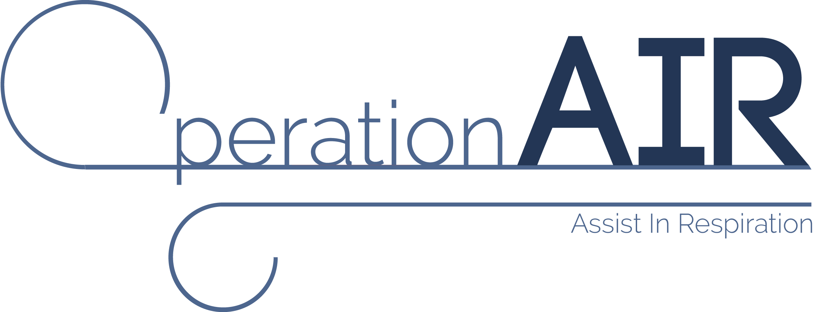
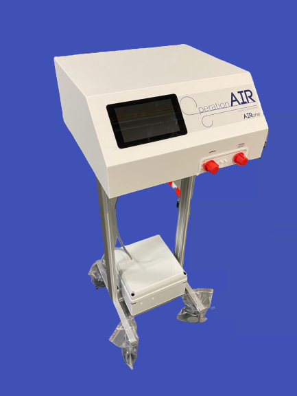
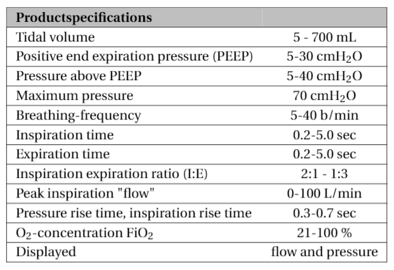
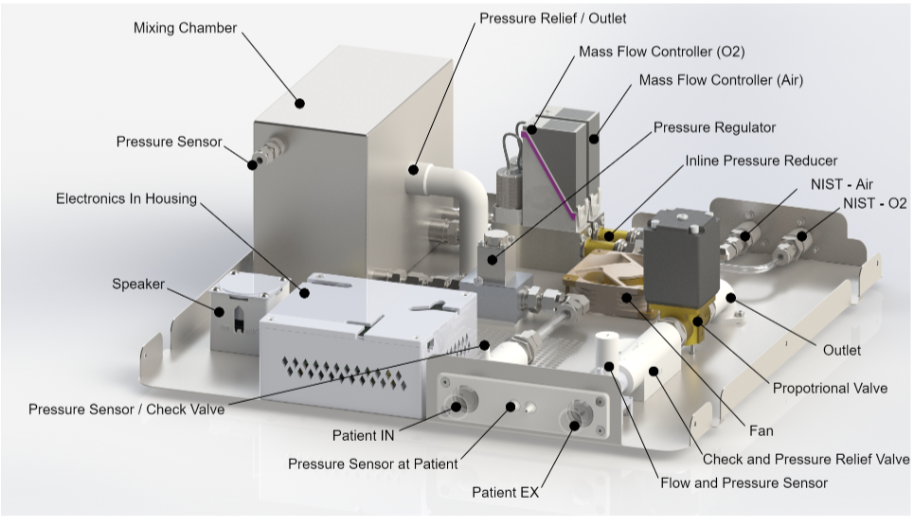

# OperationAIR - Assist In Respiration

## OperationAIR: Who are we?

OperationAIR is a student team of Delft University of Technology that developed a simplified ventilator: the AIRone. It was developed as a non-certified, advanced emergency ventilator at times of a national shortage due to the covid-19 pandemic, in close contact with experts from Leiden University Medical Center and Erasmus Medical Center.

## AIRone: What is it?

The AIRone operates and functions as a regular, pressure-regulated  ventilator, but with essential functionalities only. In short, it uses a pressurised gas source, reduces the pressure accordingly and delivers  gas to the patient by a set of proportional valves (see below for more  details). Oxygen concentration is regulated using two Mass Flow  Controllers on the gas inlets.

The  AIRone provides positive-pressure ventilation (PPV) for emergency  automatic ventilation, created for the use on adult (suspected) COVID-19 patients who need non-weaned respiratory support to bridge a longer  period of time until conventional ventilation becomes available.

## Adjustable settings

- Inspiratory pressure (Pinsp)
- Positive end-expiratory pressure (PEEP)
- Respiratory rate (RR)
- I:E ratio
- Oxygen concentration(%) (FiO2)

## Project Motivation

The design of the AIRone is final. As national ICU admissions are  dropping large scale production is not necessary. The AIRone is  currently being produced in a small batch to complete the design cycle  and to share this expertise with the international community. Software  engineers will continue to work on an additional module to enable  patient respiration triggers for weaning.

The AIRone was recommended by clinicians to be used at times of  national shortage of certified ventilators. Official approval has not  been obtained, due to the disappeared urgency of emergency ventilators.  Therefore, the safety or efficacy of the AIRone for use in humans has  not been proven. However, thorough design verification was performed  using an advanced artificial test lung. Additionally, design  documentation is under review by a notified body. Also, multiple  usability tests by doctors and nurses lead to the current user-friendly  design.

## General Working Principle

The AIRone uses pressurized medical air and oxygen that is available  in most Dutch hospitals, reduces it to the required pressure, and  delivers this to the patient using a set of proportional valves that are controlled using a central microcontroller.

The physician can start up the device and use the touchscreen (GUI)  to set ventilation parameters to the desired settings. The GUI will  communicate these setting to the MicroController Unit (MCU). The MCU  then controls all valves to ventilate the patient accordingly.

The AIRone has two male NIST (Non-interchangeable screw thread)  connectors, one for compressed medical air and one for oxygen. The  female counterparts of these connectors should be available in the Dutch hospital and can be connected to the AIRone. The input pressure of both oxygen and compressed air may vary between 4 and 8 bar. In the device,  the oxygen and air pressure is reduced to 4 bar. Two Mass Flow  Controllers (MFCs) are used to control the flow of both gasses into a  mixing chamber. This ensures a highly controlled mixing ratio, having a  gas with the desired oxygen concentration as result. A pressure sensor  in the mixing chamber gives feedback to the MFCs, adjusting their flow  to keep the pressure in the chamber at 650 mbar. As a back-up, a back  pressure regulator ensures the pressure in the chamber will never exceed 1 bar by blowing off air when the pressure is too high.

Downstream of the mixing chamber, a proportional valve regulates the  pressure going into the patient. Generally, the valve will open at the  start of inspiration and close when the pressure at the lungs is at the  desired plateau pressure.  Before the gas mixture flows to the patient  it passes a check valve which blocks flow coming back from the patient.

During expiration, the gas is filtered by a HEPA filter. The gas then passes another check valve, and also a pressure relief valve, which  opens when the pressure in the system rises above 70 cmH20. The gas is  then released to outside the system by another proportional valve that  opens at the beginning of the expiration and closes at the end of the  expiration.

------

**Be aware this design explicitly focuses on use in the Dutch  healthcare infrastructure. Alterations of this design will be needed for local implementation. Please leave your contact information and  additional information in this form so we can discuss matters or offer  advice and support:** https://forms.gle/rWXyzbqTNrqdJqee8

## DISCLAIMER

Licensor means Technische Universiteit Delft and OperationAIR. Licensee means any business, organisation or person using the Licensed Material. Licensed Material means all information pertaining to the last resort ventilator also known as the AIRone

### Intended use

1. The AIRone is a last resort device. It is not designed to replace the currently available, conventional ventilators. The AIRone is a pressure-controlled emergency mechanical ventilation system created for the treatment of COVID-19 patients, who need respiratory support, for who no conventional ventilation machine is available. 
2. The for profit exploitation of the Licensed Material is explicitly prohibited.

### Disclaimer of Warranties and Limitation of Liability.

The Licensor offers the Licensed Material “as-is” and “as-available”, and makes no representations or warranties of any kind concerning the Licensed Material, whether express, implied, statutory, or other. This includes, without limitation, warranties of title, merchantability, fitness for a particular purpose, non-infringement, absence of latent or other defects, accuracy, or the presence or absence of errors, whether or not known or discoverable.

To the extent possible, in no event will the Licensor be liable to Licensee on any legal grounds (including, but not limited to, gross negligence and wilful misconduct) or otherwise for any direct, special, indirect, incidental, consequential, punitive, exemplary, or other losses, costs, expenses, or damages arising out of this Public License or use of the Licensed Material, even if the Licensor has been advised of the possibility of such losses, costs, expenses, or damages.

The disclaimer of warranties and limitation of liability provided above shall be interpreted in a manner that, to the extent possible, most closely approximates an absolute disclaimer and waiver of all liability.

## Project Organization
